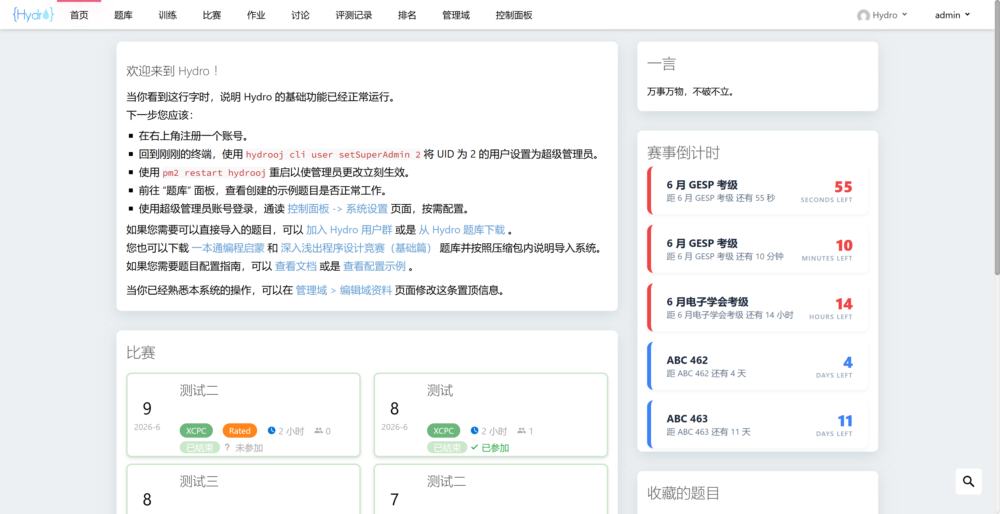

# Hydro 倒计时插件

兼容 V5.0.1 社区版，依赖 moment 库，特点如下。
1. 根据紧急程度适配不同的选项卡颜色。
2. 支持本地配置，可以只配置日期，也可以精确到时间以支持秒级倒计时。
3. 支持秒级倒计时，前端秒级静默更新，需要配置时精确到时间。
4. 支持自动抓取 ABC 最近 30 天的比赛，每天 0 点自动抓取，自动精确到时间。
5. 倒计时结束的赛事会自动删除卡片，并且根据配置自动补充赛事。
6. 每一项倒计时卡片都可以跳转到对应的赛事官网，其中 ABC 会跳转到对应比赛页面。本地配置的赛事可以配置 url，也可以不配置，name 字段包含以下关键字可以自动配置 url，
   - CSP、NOI：https://noi.cn
     CSP 默认是 CSP-J/S，如果是纯 CSP，请手动配置
   - GESP：https://gesp.ccf.org.cn
   - 电子学会、CIE：https://qceit.org.cn
   - 蓝桥：https://www.lanqiaoqingshao.cn
     默认是蓝桥青少，如果是大学生组，请手动配置
   - 天梯：https://gplt.patest.cn

安装与配置方法如下。

```bash
# 安装
cd .hydro/addons
git clone https://github.com/Clancy66/hydro-countdown.git
cd hydro-countdown
rm -rf img/
yarn install
hydrooj addon add /root/.hydro/addons/hydro-countdown
pm2 restart hydrooj

# 配置
# 在系统设置中 hydrooj.homepage 中适当的位置添加配置，示例如下
- width: 4          # 配置在右侧边栏，默认宽度为 3，这里进行了调整
  countdown:
    title: 赛事倒计时
    atcoder: true   # 改为 false 则不会自动抓取 ABC
    limit: 5
    dates:
      - name: 第 42 次 CSP
        date: 2026-06-10 08:00
        url: https://www.cspro.org
      - name: 6 月 GESP 考级
        date: 2026-06-27
      - name: CSP-J/S 第一轮
        date: 2026-09-19
```

`/img` 中是 `README.md` 的截图，安装时可以放心删除。

## 部分截图

